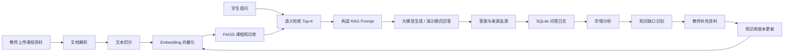

# EduRAG：面向智慧教育的可追溯课程知识库问答与学习困难诊断系统

## 项目简介

EduRAG 是一个基于 Streamlit、FAISS 和 RAG 的智慧教育系统演示项目。系统支持教师上传课程资料，自动构建课程知识库；学生可以围绕课程内容进行自然语言提问；系统返回可追溯来源的课程助教回答，并将问答日志沉淀为学情分析、知识缺口识别和知识库迭代依据。

英文题目：

EduRAG: A Traceable Course Knowledge Base Question Answering and Learning Difficulty Diagnosis System for Smart Education

## 系统特色

- 可追溯课程问答：回答展示参考来源、页码、片段和相似度。
- 演示稳定：无 OpenAI API Key 或 API 调用失败时，自动使用抽取式演示模式。
- 学习困难诊断：基于未命中问题、低相似度问题和疑难关键词分析学生薄弱点。
- 知识缺口识别：发现课程资料覆盖不足的问题，支持教师补充资料。
- 知识库迭代：记录每次知识库构建版本，体现教师反馈驱动的更新闭环。
- 小规模评估：提供检索问题集和 Top-3 命中率评估脚本。

## 功能模块

- 教师端资料管理：上传 PDF/TXT 课程资料，构建并持久化 FAISS 知识库。
- 学生端课程问答：输入问题，检索 Top-3 课程片段，生成回答或演示模式回答。
- 来源追溯：显示来源文件、页码、片段内容和检索相似度。
- 问答日志：SQLite 保存问题、回答、来源、最高相似度和是否命中。
- 学情分析：展示趋势、覆盖率、平均相似度、高频关键词和低相似度问题。
- 知识缺口：识别未命中问题、低相似度问题和高频疑难关键词。
- 版本管理：记录知识库版本、构建时间、文档数量和 chunk 数量。
- 检索评估：使用测试问题集计算 Top-3 命中率和平均最高相似度。

## 技术架构



## 数据管理闭环

```text
课程资料上传 -> 课程知识库构建 -> 学生课程问答 -> 答案来源追溯
-> 问答日志记录 -> 学习困难分析 -> 知识缺口识别
-> 教师补充资料 -> 知识库版本更新 -> 问答覆盖率提升
```

## 项目结构

```text
edu-rag/
├── app.py
├── README.md
├── requirements.txt
├── .gitignore
├── assets/
│   ├── demo_data/
│   │   └── 智慧教育示例资料.txt
│   └── eval/
│       └── questions.json
├── data/
│   ├── uploads/
│   └── vector_store/
│       └── .gitkeep
├── scripts/
│   └── evaluate_retrieval.py
└── src/
    ├── __init__.py
    ├── analytics.py
    ├── config.py
    ├── database.py
    ├── document_loader.py
    ├── embeddings.py
    ├── evaluation.py
    ├── gap_analysis.py
    ├── kb_version.py
    ├── rag_chain.py
    ├── splitter.py
    ├── ui.py
    └── vector_store.py
```

## 安装与运行

建议使用 Python 3.10 到 3.12。

```bash
cd edu-rag
python3 -m venv .venv
source .venv/bin/activate
pip install -r requirements.txt
streamlit run app.py
```

打开 Streamlit 显示的本地地址，通常为：

```text
http://localhost:8501
```

## OpenAI API Key 配置

方式一：环境变量。

```bash
export OPENAI_API_KEY="你的 OpenAI API Key"
```

方式二：在应用左侧“教师端 · 智慧教学”输入 API Key。

API Key 不会写入代码，也不会提交到 Git。

## 无 API Key 演示模式

没有 OpenAI API Key 时，系统仍然可以完整演示。只要检索命中课程资料，系统会根据 Top-3 检索片段生成抽取式回答，并提示“当前使用演示模式，未调用大模型”。OpenAI API Key 错误、网络失败、额度不足或模型名错误时，也会自动回退到演示模式，页面不会崩溃。

## 快速演示

可以使用内置示例资料快速体验：

```text
assets/demo_data/智慧教育示例资料.txt
```

演示流程：

1. 启动应用。
2. 在教师端上传 `assets/demo_data/智慧教育示例资料.txt`。
3. 点击“构建知识库”。
4. 进入学生端“课程问答”。
5. 输入示例问题并提交。
6. 查看回答、参考来源、问答记录、学情分析、知识缺口和知识库版本。

## 示例问题

1. 什么是智慧教育？
2. RAG 系统的基本流程是什么？
3. 向量数据库在课程知识库中有什么作用？
4. 为什么课程问答需要答案来源追溯？
5. 学情分析如何帮助教师改进教学？
6. 什么是知识缺口？
7. 课程问答覆盖率表示什么？

## 检索评估

项目提供了 20 条评估问题：

```text
assets/eval/questions.json
```

构建知识库后运行：

```bash
python scripts/evaluate_retrieval.py
```

输出示例：

```text
问题总数: 20
Top-3 命中数: 18
Top-3 命中率: 90.00%
平均最高相似度: 0.612
```

如果还没有构建知识库，脚本会提示先运行系统并使用示例资料构建知识库。

## 常用检查命令

```bash
python -m py_compile app.py src/*.py
pip install -r requirements.txt
streamlit run app.py
python scripts/evaluate_retrieval.py
```

使用虚拟环境时也可以执行：

```bash
.venv/bin/python -m py_compile app.py src/*.py scripts/evaluate_retrieval.py
```

## 论文贡献点

1. 设计并实现了面向课程资料的可追溯 RAG 问答框架。
2. 构建了基于问答日志的学习困难与知识缺口诊断机制。
3. 实现了教师反馈驱动的课程知识库迭代更新闭环。
4. 提供了课程问答覆盖率和检索命中率等评估指标。

## 常见问题

### 知识库为空怎么办？

请先在教师端上传 PDF/TXT 文件并点击“构建知识库”。如果已经构建过知识库，可以点击“加载已有知识库”。

### 为什么首次运行较慢？

首次运行会下载 `sentence-transformers/all-MiniLM-L6-v2` 模型，下载完成后会更快。

### 问答记录保存在哪里？

问答记录保存在项目根目录下的 `qa_logs.db`。该文件为运行生成文件，不建议提交到 Git。

### 知识库文件保存在哪里？

FAISS 索引保存到 `data/vector_store/index.faiss`，文本片段元数据保存到 `data/vector_store/chunks.pkl`。这些文件由系统运行生成，不提交到 Git。

### 什么是课程问答覆盖率？

覆盖率 = 已回答问题数 / 总问题数。覆盖率较低时，说明课程资料对学生问题的支撑不足，可以通过“知识缺口”页面补充资料并重新构建知识库。
